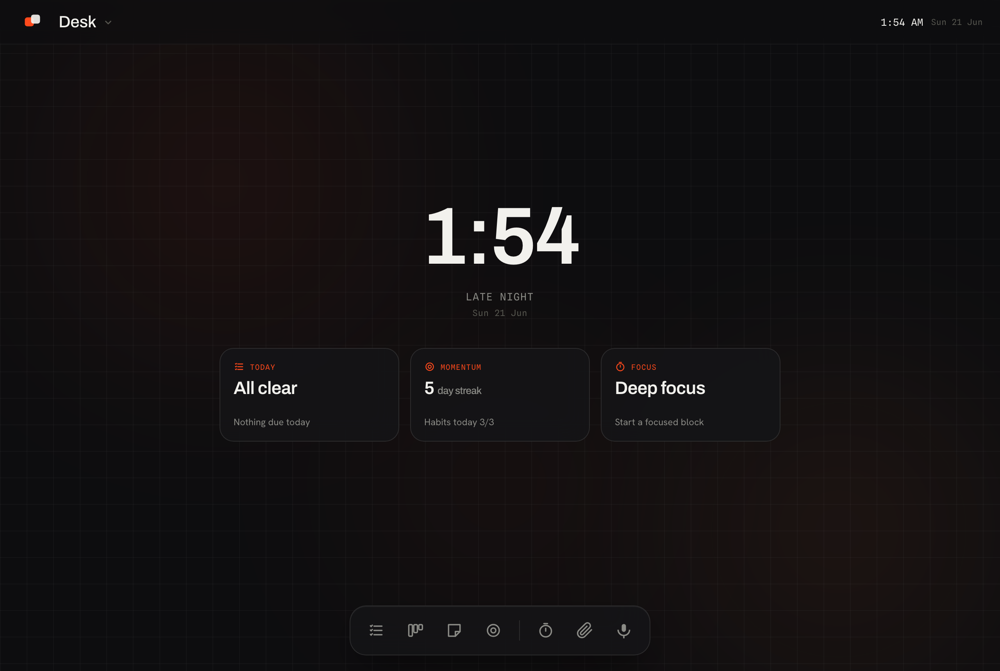
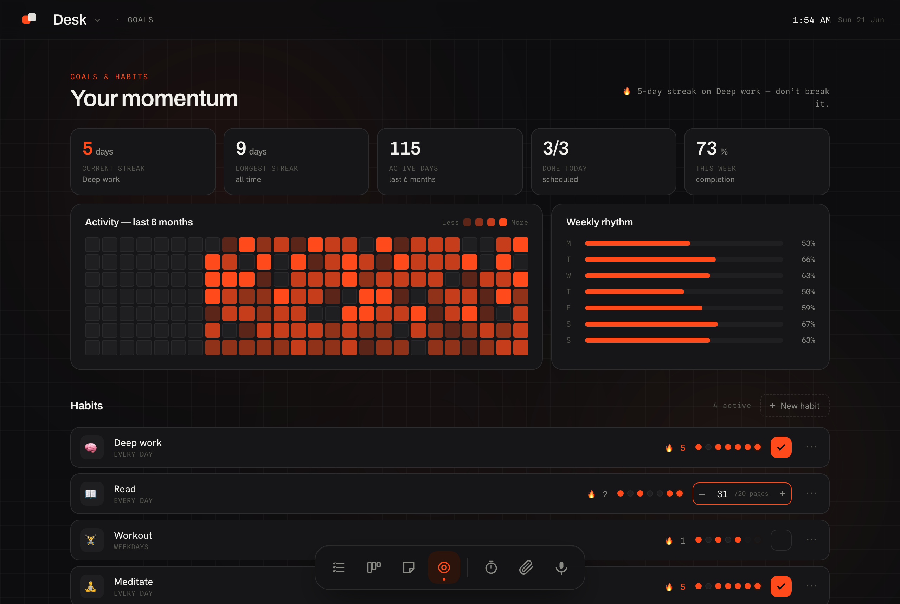

# Desk

**A calm, local-first productivity workspace that presents itself as a tiny desktop OS — and ships as one HTML file.**

Tasks, a Pipeline kanban, a Stickies canvas, and Goals & Habits live inside switchable workspaces, under an ambient "home" and a dock. An optional macOS app adds a menubar, desktop widgets, a pixel "buddy", and **fully on-device voice + AI**. No account. No backend. No cloud. Your data never leaves your machine.




---

## Why Desk is unusual

- **It's one HTML file.** The entire app is `app/index.html` — vanilla JS, no framework, no build step. Open it in a browser and it works.
- **Local-first.** State lives in your browser's IndexedDB. It runs with the network unplugged. The only outbound requests are Google Fonts and link favicons.
- **Calm by design.** An ambient home, a dock instead of a wall of tabs, time-of-day wallpaper, quiet system sounds with Do-Not-Disturb.
- **A little alive.** An optional pixel buddy reacts to your day — focus, crunch, and even grooving when music plays.
- **Private AI.** Voice capture (Whisper) and intent parsing (a local LLM via Ollama) run **100% on-device**.

## Three ways to run it

| | What you get | How |
|---|---|---|
| **1. Web** | The full app, instantly | Open `app/index.html` in any modern browser. That's it. |
| **2. PWA** | Installable, offline | Serve `/pwa` over http (e.g. `cd pwa && python3 -m http.server`), open it, and "Install" from the browser. |
| **3. macOS app** | Menubar, desktop buddy, widgets, local voice + AI | **[⬇ Download the `.dmg`](https://github.com/Shoyokage/desk/releases/latest)** (Apple Silicon) · Intel Macs → use option 1 or 2 above · or build: [`SETUP.md`](SETUP.md) |

> The web and PWA versions are the complete productivity app. The desktop buddy, Übersicht widgets, and local voice/AI are macOS-app features (they need OS integration + local processes).
>
> **First launch:** the macOS app isn't notarized, so right-click `Desk.app` → **Open** the first time (or run `xattr -dr com.apple.quarantine /Applications/Desk.app`).

## Voice & AI (optional, 100% local)

Desk can take spoken input and turn it into tasks — privately, offline:

- **Speech → text:** [Whisper](https://huggingface.co/Xenova/whisper-base.en) via `@huggingface/transformers` (auto-downloads ~40MB on first use, then cached).
- **Text → intent:** a local LLM through **[Ollama](https://ollama.com)** (default model `gemma3:1b`).

Set it up once: install Ollama, run `ollama pull gemma3:1b`, then open **Desk → `Desk ▾` menu → Voice & AI…** and hit **Test connection**. You can point Desk at any Ollama host or model from that screen. Full steps in [`SETUP.md`](SETUP.md).

## What's in the box

```
desk/
├── app/            the single-file web app (source of truth) + buddy sprites
├── desktop/        macOS Electron wrapper (menubar, buddy, voice/AI)  →  SETUP.md
├── widgets/        Übersicht desktop widgets (today · momentum · focus · activity)  →  widgets/README.md
├── extension/      Chrome "now playing" companion (lets the buddy groove to music)  →  extension/README.md
├── pwa/            installable PWA build (generated from /app by desktop/scripts/sync.js)
└── docs/           screenshots + notes
```

The web app (`app/index.html`) is the source of truth. After editing it, run `cd desktop && npm run sync` to refresh the desktop bundle and the PWA.

## The desktop buddy

A pixel sprite that lives on your desktop (or inside the app in full-screen). Click it to cycle moods — **calm** (start a focus session) and **crunch** (quick-capture) — and it automatically switches to a **music** groove whenever a song is playing (via the Chrome companion in `extension/`). Art lives in `app/*.png` + `desktop/app/sprite.json`.

## Backup & restore

Your data lives in IndexedDB on your machine. To move it, back it up, or migrate between devices: **Desk ▾ → Export…** writes the full state to `desk-backup-YYYY-MM-DD.json`; **Desk ▾ → Import…** reads one back. The Import shows an **Undo** toast for a few seconds in case you grabbed the wrong file — no destructive action without a way back.

## Privacy

Everything is local. There is no telemetry, no account, no server. Voice and AI run on your own machine via Whisper and Ollama. The one network-touching convenience is the optional Chrome "now playing" bridge, which talks only to `127.0.0.1`.

## Tech

Vanilla JS · IndexedDB · Electron (macOS) · `@huggingface/transformers` (Whisper) · Ollama (LLM) · Übersicht (widgets). No frontend framework, no bundler.

## License

[MIT](LICENSE) — see the LICENSE file (set your name as the copyright holder before publishing).

## Acknowledgements

Built with [Claude Code](https://claude.com/claude-code).
